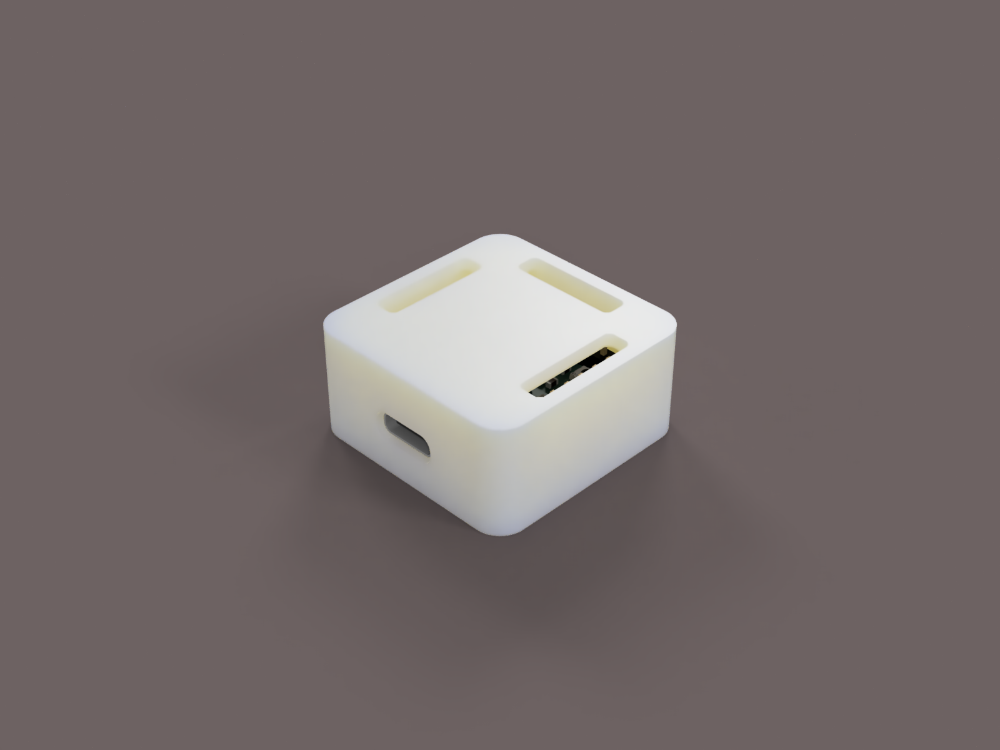
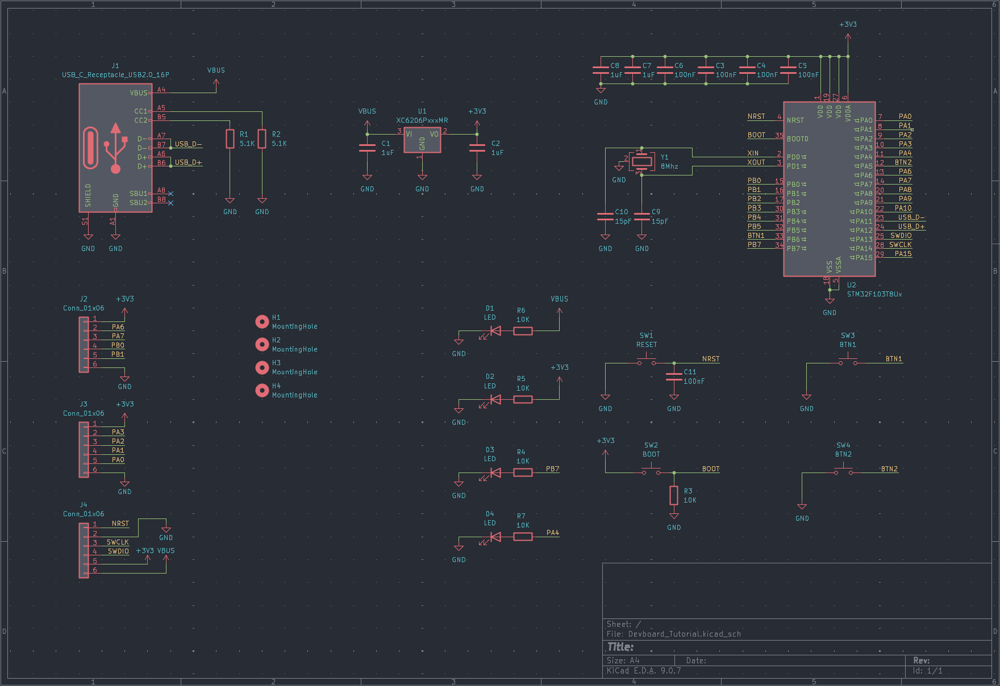
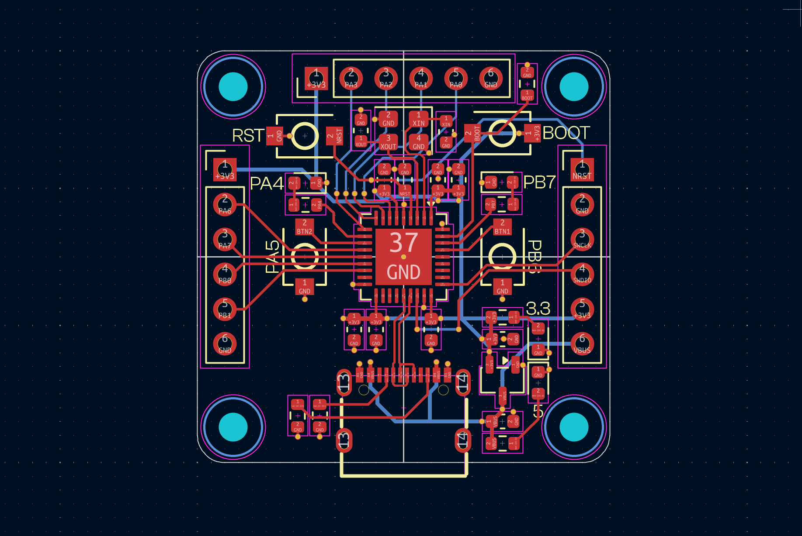
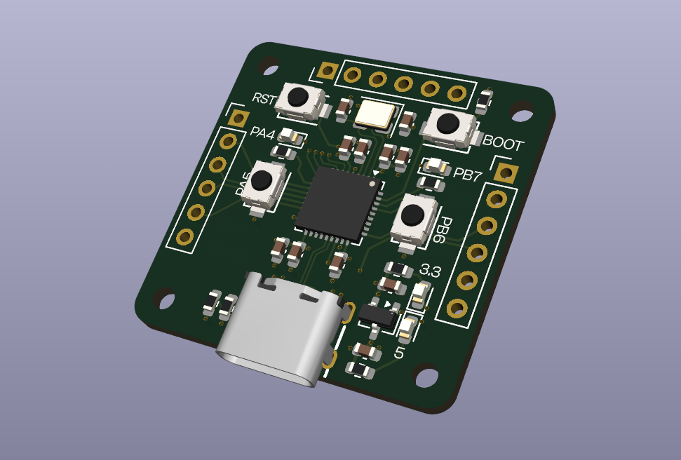
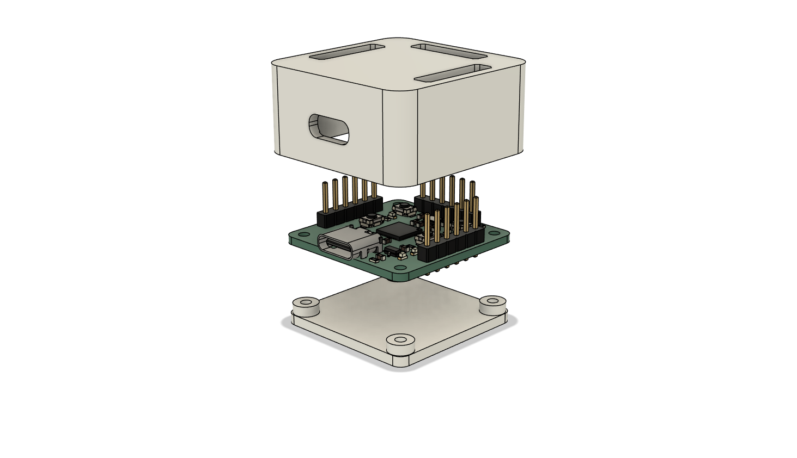

# TinySTM32

TinySTM32 is a small 30mmx30mm devboard that features a STM32F103T8U6. It has two programmable buttons and LEDs on board, and 18 pins broken out.

## Hardware

[KiCanvas Link](https://kicanvas.org/?repo=https%3A%2F%2Fgithub.com%2FOutdatedcandy92%2FTinySTM32%2Ftree%2Fmain%2Fkicad)
### Schematic

### PCB

### 3D PCB

### Case

The case uses M2 screws to mount the PCB.

## License

This project is licensed under the CERN Open Hardware Licence Version 2 Weakly Reciprocal [(CERN OHL W)](LICENSE.txt)